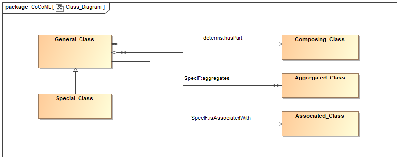

# UML Class Diagram

As a very first step, the following entities are defined:

| UML | SpecIF <dcterms:type> | OWL/RDF |
| ---: | :--- | :--- |
| uml:Class | <a href="https://specif.de/apps/edit#import=../v1.1/Ontology.specif;view=doc;project=P-SpecIF-Ontology;node=N-DC9wVTLyGWOOBEpHdGRXwrkGNWt" target="_blank">SpecIF:ModelElement</a> <uml:Class> |  |
| uml:Property | coming soon |  |
| uml:Operation | coming soon |  |

... and the following relations:

| UML | direction | SpecIF | OWL/RDF |
| ---: | :---: | :--- | :--- |
| uml:Generalization | inverted | <a href="https://specif.de/apps/edit#import=../v1.1/Ontology.specif;view=doc;project=P-SpecIF-Ontology;node=N-8pUc6Vjp86KYxpBFwvbnduOoHKp" target="_blank">SpecIF:isSpecializationOf</a> |  |
| uml:Composition | same | <a href="https://specif.de/apps/edit#import=../v1.1/Ontology.specif;view=doc;project=P-SpecIF-Ontology;node=N-5AP5qdMeBeBnURVia2BWtTlTL3r" target="_blank">dcterms:hasPart</a> |  |
| uml:Aggregation | same | <a href="https://specif.de/apps/edit#import=../v1.1/Ontology.specif;view=doc;project=P-SpecIF-Ontology;node=N-hmCfLTnuYbWWsE4qqo8zb8CwaE2" target="_blank">SpecIF:aggregates</a> |  |
| uml:Association | same | <a href="https://specif.de/apps/edit#import=../v1.1/Ontology.specif;view=doc;project=P-SpecIF-Ontology;node=N-H8KY2yoKNmBqEgSojfGX9oBclMN" target="_blank">SpecIF:isAssociatedWith</a> |  |

## Details

A directed association in UML means that only one side knows (can navigate to) the other. In SpecIF like RDF every association is a statement with subject, predicate and object. When translating a UML/SysML class diagram to SpecIF and further on to OWL/RDF:
- In case of a composition and aggregation, the class with the rhombus is the subject and the arrow is ignored. 
- In case of a general association, the arrow is interpreted as the direction according to RDF. Thus, the arrow póints from subject to object. UML associations with zero or two arrow-heads will get an arbitrary direction.

## Example

_Figure: UML Class Diagram_

The UML model transformed to SpecIF:
- The <a href="https://specif.de/apps/edit#import=../examples/CoCoML.specif.zip;view=doc;project=eee_1045467100313_135436_1;node=N-8264661645" target="_blank">UML Class Diagram</a>.
- The <a href="https://specif.de/apps/edit#import=../examples/CoCoML.specif.zip;view=statements;project=eee_1045467100313_135436_1;node=N-12061513685" target="_blank">relations of 'General_Class'</a>. 
- Download the Cameo model file [CoCoML-UML-Class Diagram](https://github.com/GfSE/CoCoML-Verification-and-Validation/blob/main/1_Source/CoCoML-UML-Class-Diagram.mdzip).
- Download the [](https://specif.de/examples/CoCoML.specif.zip target="_blank">SpecIF file</a> ... in case you want to take a closer look: Isn't it much cleaner than an XMI file?
- ... and here is the <a href="https://specif.de/apps-beta/edit.html" target="_blank">SpecIF Model-Integrator and Editor</a> to use it with your own Cameo *.mdzip files.

## Discussion

<a href="https://github.com/GfSE/CoCoML/discussions/5" target="_blank">Any questions or ideas?</a>