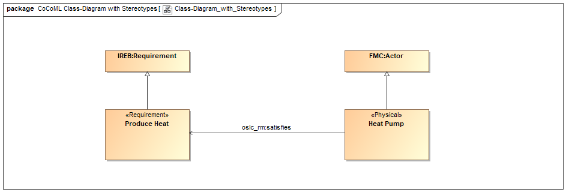
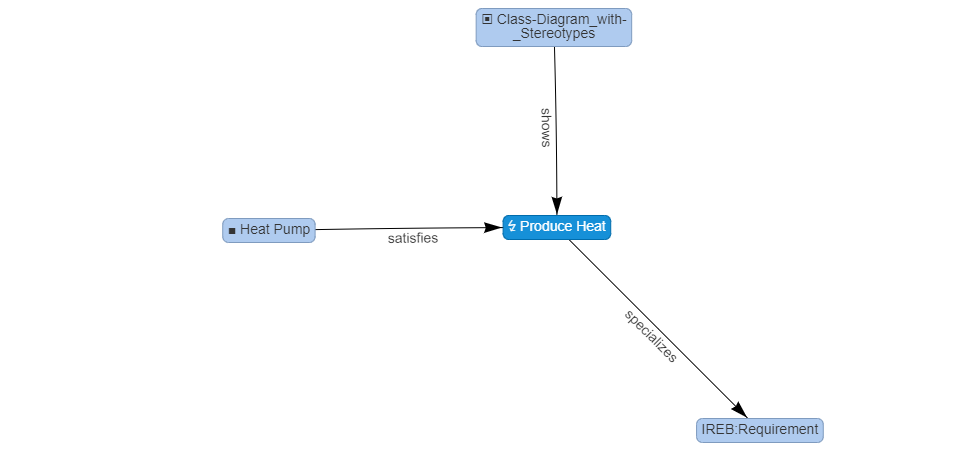

# UML Class Diagram

{: .highlight }
_Note: This is the very beginning of the discussion and in no way settled or complete._

## Transforming native UML Metaclasses

The following UML elements are selected for transformation:

| UML | SpecIF | OWL/RDF | local [en] |
| ---: | :--- | :--- | :--- |
| uml:Class | SpecIF:ModelElement |  | Model Element |
| uml:Operation | FMC:Actor |  | Actor |
| uml:Property | FMC:State |  | State |

... and the following relations:

| UML | direction | SpecIF | OWL/RDF | local [en] |
| ---: | :---: | :--- | :--- | :--- |
| uml:Generalization | inverted | <a href="https://specif.de/apps/edit#import=../v1.1/Ontology.specif;view=doc;project=P-SpecIF-Ontology;node=N-8pUc6Vjp86KYxpBFwvbnduOoHKp" target="_blank">SpecIF:isSpecializationOf</a> |  | specializes |
| uml:Composition | same | <a href="https://specif.de/apps/edit#import=../v1.1/Ontology.specif;view=doc;project=P-SpecIF-Ontology;node=N-5AP5qdMeBeBnURVia2BWtTlTL3r" target="_blank">dcterms:hasPart</a> |  | has part |
| uml:Aggregation | same | <a href="https://specif.de/apps/edit#import=../v1.1/Ontology.specif;view=doc;project=P-SpecIF-Ontology;node=N-5AP5qdMeBeBnURVia2BWtTlTL3r" target="_blank">dcterms:hasPart</a> |  | has part |
| uml:Association | same | <a href="https://specif.de/apps/edit#import=../v1.1/Ontology.specif;view=doc;project=P-SpecIF-Ontology;node=N-H8KY2yoKNmBqEgSojfGX9oBclMN" target="_blank">SpecIF:isAssociatedWith</a> |  | associated with |
| usedElements | same | <a href="https://specif.de/apps/edit#import=../v1.1/Ontology.specif;view=doc;project=P-SpecIF-Ontology;node=N-KySdnxpGEFIs3FWCaOlzbpLVEq4" target="_blank">SpecIF:shows</a> |  | shows |

<!--
| uml:Aggregation | same | <a href="https://specif.de/apps/edit#import=../v1.1/Ontology.specif;view=doc;project=P-SpecIF-Ontology;node=N-hmCfLTnuYbWWsE4qqo8zb8CwaE2" target="_blank">SpecIF:aggregates</a> |  |  |
-->

### Details

A directed association in UML means that only one side knows (can navigate to) the other. In SpecIF like RDF every association is a statement with subject, predicate and object. When translating a UML/SysML class diagram to SpecIF and further on to OWL/RDF:
- In case of a composition and aggregation, the class with the rhombus is the subject and any arrow is ignored: It doesn't matter whether there is or isn't an arrowhead on either side. 
- In case of an association, the arrow is interpreted as the direction according to RDF. Thus, the arrow póints from subject to object. UML associations with zero or two arrow-heads will get an 'undirected' flag in SpecIF.

### Example

The following UML Class Diagram uses UML native metaclasses only:

.png)
_Figure: UML Class Diagram using native metaclasses_

#### Transform first to SpecIF

The UML Class Diagram is first transformed to SpecIF. The relations of the element _General_Class_ are shown next. The names at the edges are the vocabulary terms _SpecIF:shows_, _dcterms:hasPart_, _SpecIF:isAssociatedWith_ and _SpecIF:isSpecializationOf_ translated according to the browser language; English in this case.

.png)
_Figure: SpecIF Statements of element General_Class on UML Class Diagram_

Examining the files and rigorously reviewing the approach is greatly appreciated:
- The Cameo model file <a href="https://github.com/GfSE/CoCoML-Verification-and-Validation/tree/main/Class_Diagram/1_Source/CoCoML-Class-Diagram.mdzip" target="_blank">CoCoML Class-Diagram</a>,
- the example <a href="https://specif.de/apps/edit#import=../examples/CoCoML-Class-Diagram.specif.zip" target="_blank">UML Class Diagram</a> transformed to SpecIF,
- the <a href="https://specif.de/apps/edit#import=../examples/CoCoML-Class-Diagram.specif.zip;view=statements;project=eee_1045467100313_135436_1;node=N-12061513685" target="_blank">relations of 'General_Class'</a>, 
- the corresponding <a href="https://specif.de/examples/CoCoML-Class-Diagram.specif.zip" target="_blank">SpecIF file</a> ... isn't it much cleaner than an XMI file?
- ... and the generated <a href="https://github.com/GfSE/CoCoML-Verification-and-Validation/blob/main/Class_Diagram/9_DOCX/CoCoML-Class-Diagram.docx" target="_blank">WORD(R) file</a>.
- Finally, here is an alpha-release of the <a href="https://specif.de/apps-alpha/edit.html" target="_blank">SpecIF Model-Integrator and Editor</a> for use with your own Cameo *.mdzip files. _(Please note that only the UML class diagram, SysML Block Definition Diagram and SysML Internal Block Diagram are translated as of now. The alpha release will be updated from time to time and can have breaking changes. Please open an <a href="https://github.com/GfSE/CoCoML-Verification-and-Validation/issues" target="_blank">issue ticket</a>, if you find unexpected or erroneous behavior.)_

#### Transform further to OWL/RDF

... _coming soon using OMG's MOF2RDF_

### Discussion

<a href="https://github.com/GfSE/CoCoML-Pages/discussions/5" target="_blank">Any questions or ideas?</a>

## Adding meaning using Ontology Terms

Two ways to add meaning to weakly defined model-elements are proposed in the example below:
- by stereotype: In the example below, two classes have a stereotype of an imported profile 'RFLP' defining four levels of system specification, namely _Requirement_, _Function_, _Logical_ and _Physical_. In the example it is just an additional information/definition as a value of property typed _dcterms:type_.
- by generalization: Both concrete model elements (in fact 'instances') specialize a class named with an ontology term. As a consequence they are not an instance of uml:Class, but of _IREB:Requirement_ resp. _FMC:Actor_.

The following UML elements are selected for transformation, where a generalization and/or stereotype adds the meaning:

| UML | Generalization | Stereotype | SpecIF resource class | OWL/RDF | local [en] | Comment |
| ---: | :--- | :--- | :--- | :--- | :--- | :--- |
| uml:Class | IREB:Requirement |  | IREB:Requirement |  | Requirement | _IREB:Requirement_ is an ontology term |
| uml:Class | FMC:Actor |  | FMC:Actor |  | Actor | _FMC:Actor_ is an ontology term |
| uml:Class |  | «Requirement» | SpecIF:ModelElement with property _dscterms:type_ := RFLP:Requirement |  | Model Element | _Requirement_ is a stereotype defined by profile RFLP and _RFLP:Requirement_ is an ontology term |
| uml:Class |  | «Physical» | SpecIF:ModelElement with property _dscterms:type_ := RFLP:Physical |  | Model Element | _Physical_ is a stereotype defined by profile RFLP and _RFLP:Physical_ is an ontology term |

Adding meaning to associations is simpler:

| UML | Name | SpecIF statement class | OWL/RDF | local [en] | Comment |
| ---: | :--- | :--- | :--- | :--- | :--- |
| uml:Association | oslc_rm:satisfies | oslc_rm:satisfies |  | satisfies | _oslc_rm:satisfies_ is an ontology term |

An alternative (probably better) way is to define stereotypes for the _uml:Association_ similarly to _sysml:Allocate_.

How to add meaning to weakly defined elements is a choice to discuss: <a href="https://github.com/GfSE/CoCoML-Pages/discussions/6" target="_blank">Any issues or ideas?</a>

Another topic to <a href="https://github.com/GfSE/CoCoML-Pages/discussions/5" target="_blank">discuss</a> is _class_ vs. _instance_:
- _Heat_Pump_ is obviously an instance of the system model representing a concrete device. However an _uml:Class_ is used. (The same issue arises, when a _sysml:Block_ is used, later on ...).
- At the same time _Heat_Pump_ represents a series of identical heat pumps in the real world, so it can be considered to describe a class of real world devices.

To summarize: There is a defined set of UML elements and a defined set of ontology terms to create a clear-cut model with exact semantics. 
It is claimed that this is a formal subset of UML, which must be proven by creating an equivalent EBNF representation or DSL, for example.

### Example

The following UML Class Diagram uses UML native metaclasses and ontology terms:

_Figure: UML Class Diagram using ontology terms_

#### Transform first to SpecIF

_Figure: SpecIF Statements of element Heat_Pump on UML Class Diagram using ontology terms_

Examining the files and rigorously reviewing the approach is greatly appreciated:
- The Cameo model file <a href="https://github.com/GfSE/CoCoML-Verification-and-Validation/tree/main/Class_Diagram/1_Source/CoCoML-Class-Diagram-with-Stereotypes.mdzip" target="_blank">CoCoML Class-Diagram using ontology terms</a>,
- the example <a href="https://specif.de/apps/edit#import=../examples/CoCoML-Class-Diagram-with-Stereotypes.specif.zip" target="_blank">UML Class Diagram</a> transformed to SpecIF,
- the <a href="https://specif.de/apps/edit#import=../examples/CoCoML-Class-Diagram-with-Stereotypes.specif.zip;view=statements;project=eee_1045467100313_135436_1;node=N-8258538652" target="_blank">relations of 'Heat_Pump'</a>, 
- the corresponding <a href="https://specif.de/examples/CoCoML-Class-Diagram-with-Stereotypes.specif.zip" target="_blank">SpecIF file</a>
- ... and the generated <a href="https://github.com/GfSE/CoCoML-Verification-and-Validation/blob/main/Class_Diagram/9_DOCX/CoCoML-Class-Diagram-with-Stereotypes.docx" target="_blank">WORD(R) file</a>.
- Finally, here is an alpha-release of the <a href="https://specif.de/apps-alpha/edit.html" target="_blank">SpecIF Model-Integrator and Editor</a> for use with your own Cameo *.mdzip files. _(Please note that only the UML class diagram, SysML Block Definition Diagram and SysML Internal Block Diagram are translated as of now. The alpha release will be updated from time to time and can have breaking changes. Please open an <a href="https://github.com/GfSE/CoCoML-Verification-and-Validation/issues" target="_blank">issue ticket</a>, if you find unexpected or erroneous behavior.)_

#### Transform further to OWL/RDF

... _coming soon using OMG's MOF2RDF_

## Adding meaning using Other Terms

... isn't recommended.

