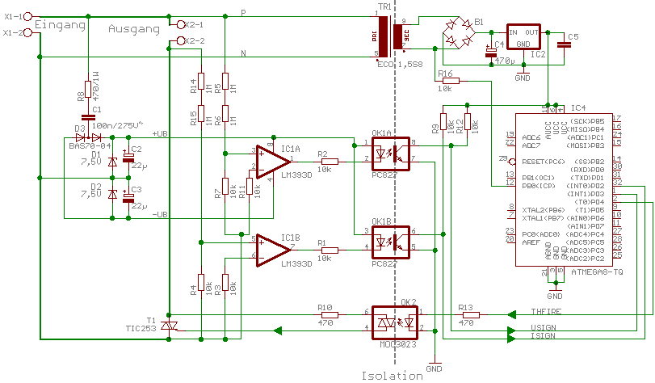
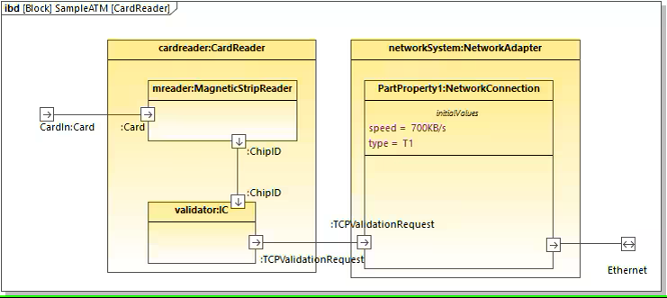

# Engineering Diagrams

What is the difference between a diagram of an electronic circuit and a, let's say, SysML block diagram?

<!--  -->

Very simply put, the electronic diagram specifies a circuit sufficiently well, so that any person educated in the domain can audit or build it without further explanation. 
In contrast, UML, SysML and many other notations are considered semi-formal. There is semantic ambiguity in many cases. 
Consequently, such a diagram must be accompanied with additional information to get the idea across.

The goal of CoCoML is to define a formally sound language to describe the concept of mechatronic devices and software. 
UML and SysML elements shall be used as graphic notation. So any CoCoML diagram shall conform with UML, but obviously not vice-versa.

fUML<super>[2]</super> defines a subset to allow model execution. It will be examined whether this approach is viable for the goals of CoCoML. 

<!--
<a href="https://github.com/GfSE/CoCoML/discussions/4" target="_blank">Any questions or ideas?</a>
-->

## Literature

1. <a href="https://ris.utwente.nl/ws/portalfiles/portal/6140830/Kent_Evans_Rumpe_1999.pdf" target="_blank">UML Semantics FAQ</a>
1. <a href="http://www.omg.org/spec/FUML/" target="_blank">Semantics of a Foundational Subset for Executable UML Models (FUML™)</a>

