<!-- templates   -->

# CoCoML - The Purpose

A concise and consistent language for modeling (mechatronic) systems and software: 
- Communicate the structure and behavior between the participants in its lifecycle;
- Bridge the gap between (engineering) disciplines and organizations.

UML/SysML offers a plethora of possibilities, is semantically vague to a certain extent and thus cannot be mapped genuinely to any other technical realm. 
CoCoML shall define a practical and formally well defined subset of UML/SysML for bidirectional and lossless mapping with OWL/RDF and perhaps other formats (to be discussed). 
Other notations and languages such as FMC, BPMN and ArchiMate shall be added in future.

CoCoML is one aspect of <a href="https://github.com/GfSE/CASCaDE-Layered-Ontology" target="_blank">CASCaDE</a>, 
an initiative to facilitate collaboration in the product lifecycle from conception to retirement - similarly to 
<a href="https://en.wikipedia.org/wiki/Building_information_modeling" target="_blank">Building Information Modeling (BIM)</a> in the construction industry. 
Goal is to submit a standard candidate at OMG - addressed at a Request for Proposals yet to be prepared and issued. 
While CASCaDE aims at the whole product lifecycle, CoCoML addresses the early phases of systems engineering and in particular UML/SysML.

<!--

... read more

This is content inside a `
` dropdown.

-->

# CoCoML - The Way Forward

## Limit the Scope

UML has been devised to specify software products. It is also used to generate software and thus offers many language features towards that end.
SysML is a UML Profile and as such shares many characteristics.
However, much less detail is needed to communicate the overarching concept of a system. 
So, the first step is to select the UML/SysML features to use for that purpose. 

Three categories are proposed:
1. Well defined feature to transform, e.g. _uml:Generalization_ or _uml:Composition_.
2. Weakly defined feature with a name to transform, e.g. _uml:Association_. The name from a controlled vocabulary adds meaning.
3. Feature not to transform. If used, a warning shall be issued.

<a href="https://github.com/GfSE/CoCoML/discussions/7" target="_blank">Any questions or ideas?</a>

## Use an Intermediate Format

The transformation shall be done in two steps using an intermediate, neutral format. 
First, it is intended to not only transform UML/SysML models, but also other MOF-based modeling notations like BPMN
and potentially others.
Second, there is interesting innovation in the context of knowledge-graphs and related data formats. It will be easier 
to generate such data from an intermediate format.
Finally, it is a fairly common and well proven approach to separate transformation in pre- and post-processing.

It is proposed to use the Specification Integration Facility ([SpecIF](https://specif.de)) as intermediate format.
It is a generic and simple information model to build a Knowledge Graph (aka Property Graph) with typed nodes, edges and properties.
[Schema and constraints](https://github.com/GfSE/SpecIF-Schema) are available to assure data quality.

While there have been numerous publications on UML to OWL/RDF transformation (see <a href="./literature" target="_blank">literature</a>), 
there has been little practical application to our knowledge. The mappings described in 
<a href="https://www.omg.org/spec/MOF2RDF/" target="_blank">OMG: MOF to RDF Mapping (MOF2RDF)</a> and
<a href="https://henrietteharmse.com/wp-content/uploads/2017/11/uml-class-diagram-to-owl-and-sroiq-reference.pdf" target="_blank">Harmse: UML Class Diagram to OWL and SROIQ Reference</a>
are most promising and will be investigated with priority.

<a href="https://github.com/GfSE/CoCoML/discussions/4" target="_blank">Any questions or ideas?</a>

## Use a Controlled Vocabulary

Among the concepts offered by UML/SysML we will select those deemed relevant for overarching system modeling.
Different modeling languages use their own terminology - but share many concepts. 
The final goal is to put system information from difference sources into a common context.  
A common terminology is essential in all those cases.

An example: A _bpmn:Lane_ and a _uml:Actor_ both represent a role with responsibility for certain activities.
The resulting ontology (resp. knowledge graph) shall represent both in the same way. 
And if used with the same name, they can be considered the same and combined.

<a href="https://github.com/GfSE/CoCoML/discussions/6" target="_blank">Any questions or ideas?</a>

## Use FMC for Abstraction

Prof. Dr.-Ing. Siegfried Wendt, founding director of the Hasso-Plattner-Institute in Potsdam, and his collaborators have shown 
that it possible to successfully describe system structure and behavior using three fundamental model elements, namely _Actor_, _State_ and _Event_. 
The concept is extremely promising for integrating models of different notations and tools: Numerous practical examples in more than a decade have shown the power of the approach. 
Therefore we propose the <a href="http://fmc-modeling.org/" target="_blank">Fundamental Modeling Concepts (FMC)</a> as an abstraction layer for system model integration.

<!--

... read more

This is content inside a `
` dropdown.

-->

<a href="https://github.com/GfSE/CoCoML/discussions/3" target="_blank">Any questions or ideas?</a>

## Joint Effort

Worldwide, there are many similar initiatives going on at moment. We do not want to re-invent the wheel: Do you know any other promising approach?

Let us join forces:
- <a href="https://github.com/GfSE/CoCoML/discussions" target="_blank">Discussions</a>
- <a href="https://github.com/GfSE/CoCoML/issues" target="_blank">Issues</a>

We will establish a 3-head technical committee to summarize the discussions and to take wise decisions.
The decision guideline will be consistency first, conciseness second. So-called "design by committee" incorporating any and every proposal shall be avoided.

Just now, in July 2024, we are at the very beginning. But we are sure that with your help and a joint effort we will succeed.

## Contact
- Dr.-Ing. Oskar von Dungern via <a href="https://github.com/odungern" target="_blank">GitHub</a>, <a href="https://www.linkedin.com/in/odungern/" target="_blank">linkedIn</a> or [e-mail](mailto:oskar.dungern@gfse.org).

